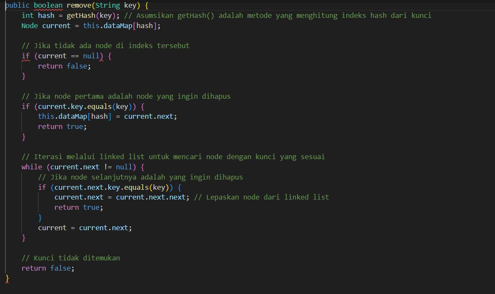

nama:rheznandya rezky artha arya putra
kelas:2C SIB
-Buatlah kelas HashTable.
-Tambahkan atribut size dan dataMap.
-Didalam kelas HashTable, tambahkan kelas internal Node. Perhatikan kelas internal Node. Kelas tersebut merupakan representasi node untuk menyimpan data dalam linked list.
-Buat konstruktor untuk kelas HashMap untuk mendeklarasikan ukuran dari array linked list.
-Buat method printTable() yang akan digunakan untuk mengetahui isi setiap slot pada hash table.
-Implementasikan fungsi hashing ASCII dengan method hash().
-Buatlah kelas HashTableMain. Kemudian buatlah beberapa nilai "key" untuk menguji hasil dari proses hashing.
-Jalankan program dan amati hasilnya.

-Tambahkan method set() yang digunakan untuk menambakan data pada hash table.
-Cetak hasil penambahakn data dengan method printTable().
-Amati hasilnya.

-Tambahkan method get() untuk mendapatkan data berdasarkan key pada hash table.
-Tambakan kode berikut pada main class untuk memastikan apakah methode get() berjalan dengan baik.
-Jalankan program dan amati hasilnya.

-Tambahkan method keys() pada hash table untuk mendapatkan semua key pada struktur data hash table. Method ini akan menggunakan ArrayList untuk menyimpan key. Pastikan Anda telah mengimport package ArrayList pada kelas HashTable.
-Tambakan kode berikut pada main class untuk mengetahui apakah method keys() dapat berkeja dengan baik
-jalankan program dan amati hasilnya.

-Apa keunggulan penanganan collision menggunakan metode separate chaining dibandingkan dengan motode linear probing?
separate chaining dianggap lebih efektif dalam menangani collision pada tabel hash dengan load factor tinggi dan menawarkan fleksibilitas serta kinerja yang lebih baik dalam kondisi tertentu dibandingkan dengan linear probing.
-Apa maksud dari potongan kode berikut pada method hash()?
Potongan kode tersebut adalah implementasi sederhana dari fungsi hash untuk sebuah hash table. Tujuannya adalah untuk mengonversi kunci (key) yang mungkin berupa string atau bentuk data lainnya ke dalam indeks integer yang bisa digunakan untuk menempatkan atau mengambil nilai dari hash table.
-Apa maksud dari potongan kode berikut pada method set()?
Potongan kode tersebut adalah bagian dari metode set() dalam implementasi hash table dengan metode separate chaining. Kode ini berfungsi untuk menambahkan nilai ke kunci yang sudah ada atau menambahkan node baru ke linked list jika kunci tersebut belum ada.
-Buatlah method remove() untuk menghapus data berdasarkan key.

Tugas
