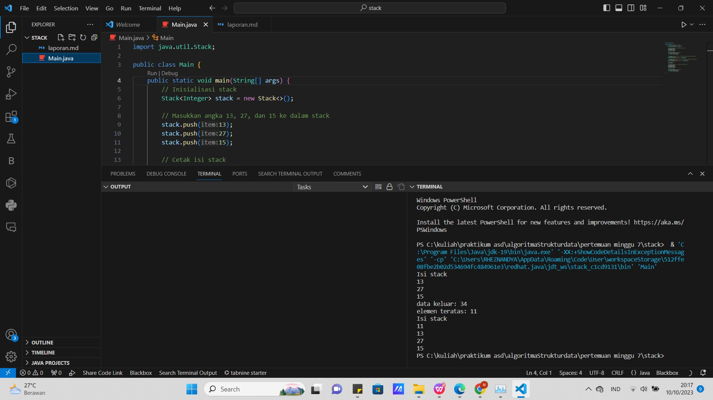

                                                    JOBSHEET VII
                                                       STACk

nama rheznandya rezky artha arya putra 
kls:2c sib

7.2.1 Langkah-langkah Percobaan
1. Perhatikan Diagram Class Stack berikut ini:
2. Buat project baru dengan nama Jobsheet7, buat package dengan nama Praktikum1, kemudian 
buat class baru dengan nama Stack.
3. Tambahkan atribut size, top, dan data seperti gambar berikut ini.
4. Tambahkan pula konstruktor berparameter seperti gambar berikut ini.
5. Buat method IsEmpty bertipe boolean yang digunakan untuk mengecek apakah stack kosong.
6. Buat method IsFull bertipe boolean yang digunakan untuk mengecek apakah stack sudah terisi 
penuh.
7. Buat method push bertipe void untuk menambahkan isi elemen stack dengan parameter dt yang 
bertipe integer
8. Buat method Pop bertipe void untuk mengeluarkan isi elemen stack
9. Buat method peek bertipe void untuk memeriksa elemen stack pada posisi paling atas.
10. Buat method print bertipe void untuk menampilkan seluruh elemen pada stack.
11. Buat method clear bertipe void untuk menghapus seluruh isi stack.
12. Selanjutnya, buat class baru dengan nama StackMain tetap pada package Praktikum1. Buat 
fungsi main, kemudian lakukan instansiasi objek dengan nama stk dan nilai parameternya adalah 
5.
13. Lakukan pengisian data pada Stack dengan cara memanggil method push. Data diisikan satu 
persatu.
14. Tampilkan data yang sudah Anda isikan di langkah sebelumnya dengan cara memanggil method 
print.
15. Lakukan pengisian data kembali dengan memanggil method push untuk menambahkan dua data 
baru, kemudian panggil method pop untuk mengeluarkan sebuah data, kemudian cek data 
teratas dengan method peek, dan tampilkan kembali seluruh data menggunakan method print.
16. Compile dan jalankan class StackMain, kemudian amati hasilnya.
7.2.2 Verifikasi Hasil Percobaan

7.2.3 Pertanyaan
1. Perhatikan class StackMain, apakah fungsi angka 5 pada potongan kode program berikut?
jawab
Kode stack stk = new Stack(5); menginisialisasi sebuah objek Stack dengan kapasitas awal 5. Dengan kata lain, stack ini dirancang untuk menampung hingga 5 elemen awal. Jika lebih banyak elemen ditambahkan, stack akan otomatis diperluas sesuai kebutuhan. Namun, perlu dicatat bahwa pustaka java.util.Stack dari Java tidak disarankan untuk digunakan lagi, dan sebaiknya digunakan koleksi generik seperti java.util.ArrayDeque sebagai penggantinya.
2. Lakukan penambahan data ke stack sebanyak dua kali, menggunakan angka 18 dan 40. Tampilkan 
hasilnya!
jawab

3. Pada soal nomor 2, mengapa data yang dimasukkan ke dalam Stack hanya angka 18, sedangkan 
angka 40 tidak dimasukkan? Jelaskan!
jawab 
 jika Anda menjalankan kode tersebut dan hanya melihat angka 18 dalam output atau ada masalah lain dalam kode tersebut, maka masalahnya mungkin ada pada pelaksanaannya atau pada bagian kode yang tidak ditampilkan. Pastikan Anda menjalankan kode dengan benar, dan jika ada masalah lebih lanjut, mungkin ada faktor lain yang mempengaruhi hasilnya yang perlu diperiksa, seperti kesalahan dalam lingkungan pengembangan Anda atau masalah lainnya.
 7.3 Praktikum 2
 7.3.1 Langkah-langkah Percobaan
1. Perhatikan Diagram Class Buku berikut ini:
2. Buat package dengan nama Praktikum2, kemudian buat class baru dengan nama Buku.
3. Tambahkan atribut-atribut Buku seperti pada Class Diagram Buku, kemudian tambahkan pula 
konstruktornya seperti gambar berikut ini.
4. Salin kode program class Stack pada Praktikum1 untuk digunakan kembali pada Praktikum2 ini. 
Karena pada Praktikum1, data yang disimpan pada stack hanya berupa array bertipe integer, 
sedangkan pada Praktikum2 data yang digunakan adalah object, maka perlu dilakukan modifikasi 
pada class Stack tersebut.
5. Lakukan modifikasi pada class Stack dengan mengubah tipe int data[] menjadi Buku data[]
karena pada kasus ini data yang akan disimpan pada stack berupa object Buku. Modifikasi perlu 
dilakukan pada atribut, konstruktor, method push, dan method pop.
6. Karena satu elemen stack terdiri dari beberapa informasi (judul, nama pengarang, tahun terbit, 
jumlah halaman, dan harga), maka ketika mencetak data juga perlu ditampilkan semua informasi 
tersebut, sehingga modifikasi perlu dilakukan pada method pop, method peek, dan method 
print. Ketika mencetak, semua atribut dari objek buku harus dipanggil.
7. Selanjutnya, buat class baru dengan nama StackMain tetap pada package Praktikum2. Buat 
fungsi main, kemudian lakukan instansiasi objek dengan nama st dan nilai parameternya adalah 
8.
8. Deklarasikan Scanner dengan nama sc
9. Tambahkan kode berikut ini untuk menerima input data Buku, kemudian semua informasi 
tersebut dimasukkan ke dalam stack
Catatan: sintaks sc.nextLine() sebelum sintaks st.push(bk) digunakan untuk mengabaikan 
karakter new line
10. Lakukan pemanggilan method print, method pop, dan method peek dengan urutan sebagai 
berikut.
11. Compile dan jalankan class StackMain, kemudian amati hasilnya.
7.3.2 Verifikasi Hasil Percobaan

7.3.3 Pertanyaan
1. Perhatikan class StackMain, pada saat memanggil fungsi push, parameter yang dikirimkan adalah 
bk. Data apa yang tersimpan pada variabel bk tersebut?
jawab
Pada saat memanggil st.push(bk), parameter bk yang dikirimkan adalah objek Buku. Objek Buku tersebut adalah data buku yang telah dibuat sebelumnya dengan judul "Pemrograman", pengarang "Burhantoro", tahun terbit 2016, jumlah halaman 126, dan harga 58000. Jadi, data buku ini yang akan disimpan dalam stack.
2. Tunjukkan potongan kode program untuk menentukan kapasitas penampungan stack!
jawab 
Potongan kode program untuk menentukan kapasitas penampungan stack ada pada inisialisasi objek Stack<Buku> stack = new Stack<>();. Kapasitas penampungan stack ditentukan oleh tipe objek yang digunakan dalam stack. Pada kasus ini, objek adalah Buku, dan ukuran stack tidak dibatasi secara eksplisit, jadi akan dapat menampung sejumlah objek Buku yang sesuai.

3. Apakah fungsi penggunaan do-while yang terdapat pada class StackMain?
jawab
Fungsi penggunaan do-while yang terdapat pada class StackMain digunakan untuk memungkinkan pengguna untuk terus menambahkan data buku ke dalam stack sebanyak yang mereka inginkan. Setelah data dimasukkan, program akan menanyakan apakah pengguna ingin menambahkan data baru atau tidak. Jika pengguna menjawab "y" (yes), maka program akan kembali meminta input data buku baru dan menambahkannya ke dalam stack. Ini memastikan bahwa pengguna dapat menambahkan lebih dari satu data buku ke dalam stack tanpa harus menjalankan program berulang kali.
4. Modifikasi kode program pada class StackMain sehingga pengguna dapat memilih operasi operasi pada stack (push, pop, peek, atau print) melalui pilihan menu program!
jawab

7.4 Praktikum 3
7.4.1 Langkah-langkah Percobaan
1. Perhatikan Diagram Class berikut ini:
2. Buat package dengan nama Praktikum3, kemudian buat class baru dengan nama Postfix. 
Tambahkan atribut n, top, dan stack sesuai diagram class Postfix tersebut.
3. Tambahkan pula konstruktor berparameter seperti gambar berikut ini.
4. Buat method push dan pop bertipe void.
5. Buat method IsOperand dengan tipe boolean yang digunakan untuk mengecek apakah elemen 
data berupa operand.
6. Buat method IsOperator dengan tipe boolean yang digunakan untuk mengecek apakah elemen 
data berupa operator.
7. Buat method derajat yang mempunyai nilai kembalian integer untuk menentukan derajat 
operator.
8. Buat method konversi untuk melakukan konversi notasi infix menjadi notasi postfix dengan cara 
mengecek satu persatu elemen data pada String Q sebagai parameter masukan.
9. Selanjutnya, buat class baru dengan nama PostfixMain tetap pada package Praktikum3. Buat 
class main, kemudian buat variabel P dan Q. Variabel P digunakan untuk menyimpan hasil akhir 
notasi postfix setelah dikonversi, sedangkan variabel Q digunakan untuk menyimpan masukan 
dari pengguna berupa ekspresi matematika dengan notasi infix. Deklarasikan variabel Scanner 
dengan nama sc, kemudian panggil fungsi built-in trim yang digunakan untuk menghapus adanya 
spasi di depan atau di belakang teks dari teks persamaan yang dimasukkan oleh pengguna.
Penambahan string “)” digunakan untuk memastikan semua simbol/karakter yang masih berada 
di stack setelah semua persamaan terbaca, akan dikeluarkan dan dipindahkan ke postfix.
10. Buat variabel total untuk menghitung banyaknya karaketer pada variabel Q.
11. Lakukan instansiasi objek dengan nama post dan nilai parameternya adalah total. Kemudian 
panggil method konversi untuk melakukan konversi notasi infix Q menjadi notasi postfix P.
12. Compile dan jalankan class PostfixMain dan amati hasilnya.

7.4.3 Pertanyaan
1. Perhatikan class Postfix, jelaskan alur kerja method derajat!
BE 
jawab 
Input: 3*5 (8-6)%3
1. Ekspresi postfix diiterasi karakter per karakter.
2. Karakter pertama adalah 3, yang merupakan operand.
3. 3 ditambahkan ke stack.
4. Karakter kedua adalah *, yang merupakan operator perkalian.
5. Dua operand dikeluarkan dari stack.
6. Derajat 3 dengan operator perkalian adalah 1.
7. Hasil perhitungan ditambahkan ke stack.
8. Karakter ketiga adalah 5, yang merupakan operand.
9. 5 ditambahkan ke stack.
10. Karakter keempat adalah ^, yang merupakan operator perpangkatan.
11. Dua operand dikeluarkan dari stack.
12. Derajat 5 dengan operator perpangkatan adalah (8-6) 
13. Hasil perhitungan ditambahkan ke stack=2.
14. Karakter kelima adalah %, yang merupakan operator modulus.
15. Dua operand dikeluarkan dari stack.
16. Derajat (8-6) dengan operator modulus adalah 1.
17. Hasil perhitungan ditambahkan ke stack.
18. Operand terakhir dikeluarkan dari stack.
19. Derajat 1 adalah 1.
20. Method derajat mengembalikan nilai derajat tersebut, yaitu 1.

2. Apa fungsi kode program berikut?
c=Q.charAt(1);
jawab
kode program c=Q.charAt(1); berfungsi untuk mengambil karakter ke-1 dari string Q dan menyimpannya ke dalam variabel c.
3. Jalankan kembali program tersebut, masukkan ekspresi 3*5^(8-6)%3. Tampilkan hasilnya!
jawab
Screenshot (960).png

4. Pada soal nomor 2, mengapa tanda kurung tidak ditampilkan pada hasil konversi? Jelaskan!
jawab
Tanda kurung pada fungsi charAt() tidak perlu ditampilkan karena sudah jelas dari notasi postfix tersebut bahwa fungsi charAt() akan mengambil karakter ke-1 dari string Q.

7.5 Tugas
1. Buat program dengan menggunakan konsep Stack untuk memasukkan sebuah kalimat, kemudian 
keluaran yang ditampilkan berupa kalimat dengan urutan karakter terbalik!
jawab:

2. Setiap hari Minggu, Dewi pergi berbelanja ke salah satu supermarket yang berada di area 
rumahnya. Setiap kali selesai berbelanja, Dewi menyimpan struk belanjaannya di dalam laci. 
Setelah dua bulan, ternyata Dewi sudah mempunyai delapan struk belanja. Dewi berencana 
mengambil lima struk belanja untuk ditukarkan dengan voucher belanja.
Buat sebuah program stack untuk menyimpan data struk belanja Dewi, kemudian lakukan juga 
proses pengambilan data struk belanja. Informasi yang tersimpan pada struk belanja terdiri dari:
• Nomor transaksi
• Tanggal pembelian
• Jumlah barang yang dibeli
• Total harga bayar
jawab:
