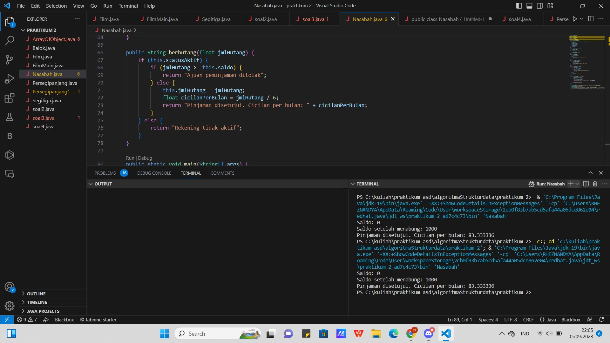

# Laporan Pertemuan 2
Nama: rheznandya rezky artha arya putra

Kelas: SIB-2C

NIM: 2241760036
# 2.2 Deklarasi Class, Atribut dan Method
 

# 2.3 Instansiasi Objek dan Mengakses Atribut & Method

# 2.4 membuat konstruktor

# 2.5 Membuat Array dari Object, Mengisi dan Menampilkan

1. 

# 2.6 Menerima input Isoan Array menggunakan Looping
1. 

# 2.7 Operasi Matematika Atribut Object Array

1. 

# 2.2.3 Pertanyaan
1. Sebutkan 2 Karakteristik Class/objek!

Jawab: atribut dan method.

2. Kata kunci apkah yang digunakan untuk Mendeklarasikan Class?

jawab: Kata kunci yang digunakan untuk mendeklarasikan class adalah class

3. Perhatikan class Film yang ada di Praktikum di atas, ada berapa atribut yang dimiliki oleh class tersebut? Sebutkan! Dan pada baris berapa saja deklarasi atribut dilakukan?

jawab: Atribute yang ada pada class Film ada 5 yaitu, judul, genre, rate, jumlahTiket, dan hargaTiket

4. Ada berapa method yang dimiliki oleh class tersebut? Sebutkan!

jawab: Terdapat 4 method yaitu tampilFilm,tambahTiket,kurangTiket,totalRevenue. 

5. Perhatikan method kurangiTiket() yang ada di class Film, modifikasi isi method tersebut
sehingga proses pengurangan hanya dilakukan jika stok masih ada (masih lebih besar dari 0)

Jawab: 

6. Menurut Anda, mengapa method tambahTiket() dibuat dengan memiliki 1 parameter berupa
bilangan int?

Jawab: : karena parameter tersebut digunakan untuk menentukan jumlah tiket yang akan 
ditambahkan. Parameter ini dideklarasikan sebagai tipe data int karena jumlah tiket harus 
berupa bilangan bulat.

7. Menurut Anda, mengapa method totalRevenue() memiliki tipe data int?

Jawab: karena hasil dari perhitungannya adalah berupa bilangan bulat. Perhitungan total revenue 
dilakukan dengan mengalikan jumlah tiket dengan harga tiket. Jumlah tiket dan harga tiket 
keduanya merupakan bilangan bulat, sehingga hasil dari perkalian tersebut juga merupakan 
bilangan bulat

8. Menurut Anda, mengapa method tambahTiket() memiliki tipe data void?

Jawab: Method tambahTiket() memiliki tipe data void karena method ini tidak mengembalikan nilai 
apa pun. Method ini hanya melakukan operasi penambahan jumlah tiket.
Jika method tambahTiket() memiliki tipe data int, maka method tersebut harus 
mengembalikan nilai jumlah tiket yang baru. Namun, dalam hal ini, jumlah tiket yang baru 
sudah dapat diketahui langsung dari operasi penambahan yang dilakukan oleh method tersebut. 
Oleh karena itu, tidak perlu mengembalikan nilai tersebut secara eksplisit.
# 2.3.3 Pertanyaan
1. Pada class FilmMain, pada kode apa yang digunakan untuk proses instansiasi? Apa nama objek yang dihasilkan?

Jawab: Dalam bahasa pemrograman Java, proses pembuatan 
instance objek dilakukan dengan menggunakan kata kunci new diikuti 
dengan nama kelas (konstruktor) yang akan dibuat instance-nya. Jika 
Anda memiliki kelas bernama film

2. Bagaimana cara mengakses atribut dan method dari suatu objek?

Jawab: Dalam bahasa pemrograman Java, Anda dapat menggunakan operator "." untuk mengakses properti 
(variabel) dan metode (fungsi) suatu objek. (Melihat). Berikut adalah contoh cara mengakses 
properti dan metode suatu objek:
Misalkan kita memiliki kelas film, yang memiliki properti title dan metode displayInformation, lalu 
kita membuat instance objek fim dan mengakses properti dan metode objek tersebut.
Kesimpulannya
Kami menggunakan objek film untuk mengakses properti judul dan metode film 
object.showInformation() untuk mengakses metode displayInformation. Perhatikan bahwa kita 
menggunakan objek film yang dipakai sebelumnya untuk mengakses properti dan metode yang 
terdapat dalam kelas film.
# 2.4.3 Pertanyaan

1. Perhatikan class Film yang ada di Praktikum 2.4.1 pada baris berapakah deklarasi konstruktor berparameter dilakukan?

Jawab:?6 yaitu beberapa parameter seperti judul, genre, 
rate, jumlah tiket, dan harga tiket.
   

2. Perhatikan class FilmMain di Praktikum 2.4.1, apa sebenarnya yang dilakukan pada baris program dibawah ini

Jawab: untuk membuat objek sekaligus mengatur nilainya saat objek tersebut dibuat
3. coba buat objek dengan nama film3 dengan menggunakan kostruktor berparameter dari class Barang.

Jawab: 

# 2.5.3 Pertanyaan 
1. Berdasarkan Uji coba 3.2 apakah class yang akan dibuat array of object harus selalu memiliki atribut dan sekaligus method?Jelaskan!

Jawab: Tidak, class yang akan dibuat sebagai array 
of object tidak harus memiliki atribut dan metode secara bersamaan. Anda 
dapat memiliki class yang hanya memiliki atribut tanpa metode, atau 
sebaliknya, hanya memiliki metode tanpa atribut. Ketergantungan antara 
atribut dan metode dalam class seharusnya bergantung pada kebutuhan 
program Anda.

2. Apakah class PersegiPanjang memiliki konstruktor? Jika tidak,kenapa dilakukan pemanggilan konstruktur pada baris program berikut :

Jawab: tidak memiliki deklarasi konstruktor khusus yang ditulis oleh Anda. Ketika Anda tidak
mendeklarasikan konstruktor dalam class, Java akan memberikan konstruktor default 
tanpa parameter secara otomatis.
3. Apa yang dimaskud dengan kode berikut ini:

Jawab: "Setiap elemen dalam array ini akan menjadi objek PersegiPanjang, dan karena Anda tidak 
memberikan nilai awal untuk setiap elemen, maka objek-objek tersebut akan diinisialisasi 
dengan nilai default. Anda perlu membuat dan menginisialisasi setiap objek PersegiPanjang 
secara terpisah sebelum Anda dapat mengakses atau menggunakan mereka dalam array. 
Namun, perlu diperhatikan bahwa penggunaan new PersegiPanjang hanya akan 
mengalokasikan memori untuk array tersebut. new PersegiPanjang adalah bagian yang 
mengalokasikan memori untuk array tersebut dengan panjang 3."

4. Apa yang dimaksud dengan kode berikut ini:

Jawab: 
"Setiap elemen dalam array tersebut perlu diinisialisasi secara terpisah, karena array hanya 
mengalokasikan memori untuk objek tanpa menginisialisasi nilainya secara otomatis. Dengan 
ppArray .panjang = 110; dan ppArray .lebar = 30;, Anda mengatur nilai-nilai atribut panjang dan lebar 
dari objek dalam elemen pertama dari array."
5. Mengapa class main dan juga class PersegiPanjang dipisahkan pada uji coba 3.2?

Jawab: karena praktik yang umum dalam pemrograman berorientasi objek dan Java
# 2.6.3 Pertanyaan 
1. Apakah array of object dapat diimplementasikan pada array 2 Dimensi?

Jawab: Ya, array of object dapat diimplementasikan pada array 2 dimensi.
2. Jika jawaban soal no satu iya,berikan contohnya! jika tidak,jelaskan!

Jawab: 

3. jika diketahui terdapat class Persegi yang memiliki atribut sisi bertipe integer, maka kode dibawah ini akan memnunculkan eror saat dijalankan. Mengapa?

Jawab: Kode tersebut akan memunculkan error saat dijalankan karena indeks array 
pgArray tidak boleh melebihi kapasitas array tersebut. Pada kode tersebut, 
kapasitas array pgArray adalah 100, sedangkan indeks 5 lebih besar dari 100

4. Modifikasi kode program pada praktikum 3.3 agar length array menjadi inputan dengan Scanner!

Jawab: 

5. Apakah boleh jika terjadi duplikasi instansiasi array of objek,misalkan saja instansiasi dilakukan pada ppArray[i] sekaligus pp Array [0]? Jelaskan!

Jawab: tidak boleh jika terjadi duplikasi instansiasi array of objek. Duplikasi instansiasi array of 
objek akan menyebabkan adanya dua referensi ke objek yang sama. Hal ini dapat 
menyebabkan masalah jika salah satu referensi tersebut diubah, maka referensi lainnya 
juga akan ikut berubah.
# 2.7.3 Pertanyaan
1. Dapatkah konstruktor berjumlah lebih dalam satu kelas? Jelaskan dengan contoh!

Jawab: Ya, konstruktor dapat berjumlah lebih dalam satu kelas. Hal ini 
memungkinkan kita untuk membuat konstruktor dengan berbagai parameter 
yang berbeda untuk memenuhi kebutuhan yang berbeda.

2. Tambahkan konstruktor pada class Segitiga tersebut yang berisi parameter int a, int t yang masing-masing digunakan untuk mengisikan atribut alas dan tinggi.

3. Tambahkan method hitungLuas() dan hitungKeliling() pada class Segitiga
tersebut. Asumsi segitiga adalah segitiga siku-siku. (Hint: Anda dapat 
 menggunakan bantuan library Math pada Java untuk mengkalkulasi sisi miring)

 

4. Pada fungsi main, buat array Segitiga sgArray yang berisi 4 elemen, isikan masing- masing atributnya sebagai berikut:

    sgArray ke-0 alas: 10, tinggi: 4

    sgArray ke-1 alas: 20, tinggi: 10

    sgArray ke-2 alas: 15, tinggi: 6

    sgArray ke-3 alas: 25, tinggi: 10

    Kemudian menggunakan looping, cetak luas dan keliling dengan cara memanggil method
hitungLuas() dan hitungKeliling()

Jawab:

# 2.8 Tugas Praktikum
1.
2.
3.